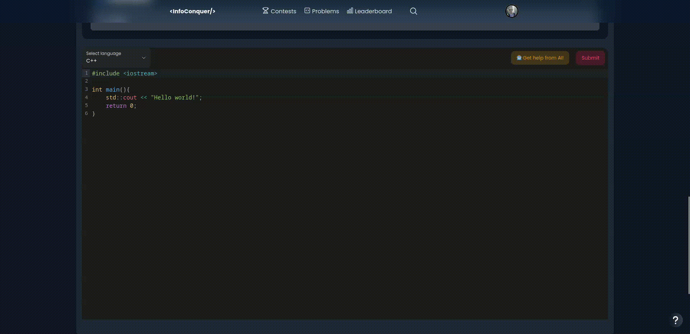
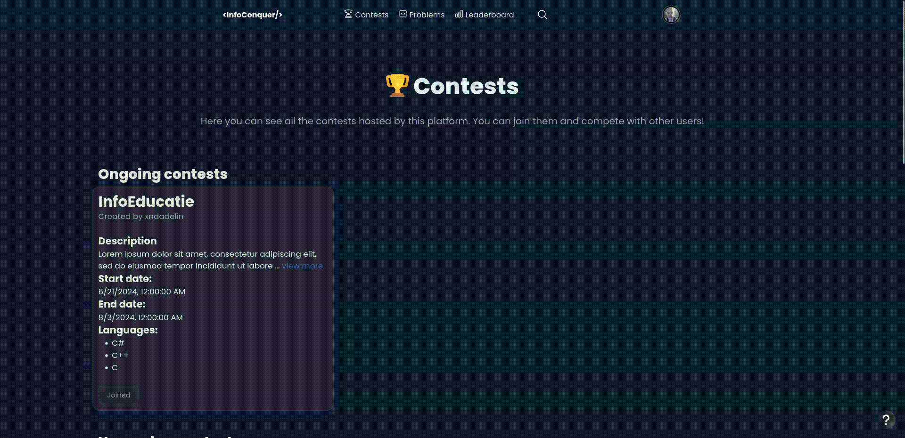
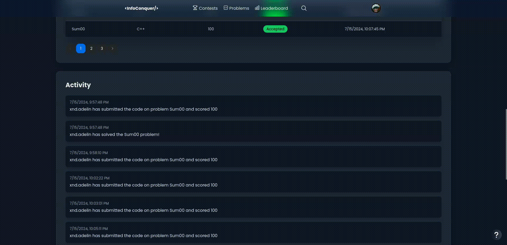
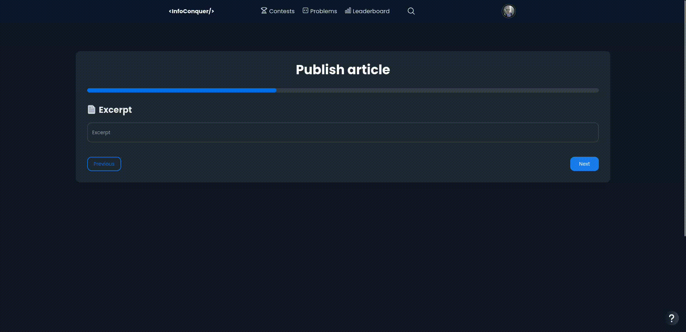

> InfoConquer is a website designed for programmers, whether beginners or advanced. Users can solve algorithmic problems, receiving feedback based on tests uploaded from the platform. Problems range from fundamental data structures to advanced graph theories. At the same time, they can participate in algorithmic competitions with other participants and maintain a series of daily problem solving by accessing the calendar on the platform, which offers a daily problem.

[DOCUMENTATION](https://infoconquer.gitbook.io/infoconquer)
## ⚙️ Features

Through this project, I managed to create a website that facilitates learning and improving programming skills for users of all levels.

Therefore, among the features of the project are:

### 📘 Viewing and solving problems
- 🧠 Users can solve algorithmic problems in a programming language of their choice
- 📝 Functionality subject to a form completed by an admin, which represents all problem details (description, examples, output, input, time limit, memory limit, tests, etc.)
- 💻 Integrated code editor [CodeMirror](https://uiwjs.github.io/react-codemirror/)
- 📊 Problem statistics (graph with number of solutions in the last 7 days, first accepted submissions, best solutions in terms of time and memory)


### ℹ️ Integrated code judge
- 🤖 Automatically evaluates solutions submitted by users, providing instant and detailed feedback based on predefined tests
- 🛡️ Uses a secure sandbox, similar to the one used at IOI (International Olympiad in Informatics)
- 🔗 More details: [GitHub - ioi/isolate](https://github.com/ioi/isolate)

### 🗓️ Calendar with daily problems
- 🎲 Proposes a random problem each day
- 🏆 Encourages users to maintain their solving streak, preserving more significant activity


### 🤖 Integrated OpenAI Assistant
- 🧠 Embedded in the code editor
- 💡 Helps users receive feedback on their code, mentioning what can be optimized, what to change, and helps them solve the problem
- 🔧 Uses the GPT-4 model from [OpenAI](https://openai.com/)



### 🏆 Algorithmic competitions
- 🌐 The platform can host competitions for all users, regardless of level
- 📊 The competition page includes real-time rankings, competition details, and a graph regarding problem solvability



### 👤 User profile
- 📌 General information about the user (avatar, name, status, creation date)
- 📊 Statistics (solved problems, total submissions, accepted solutions)
- 📅 Activity visualization
- ⚙️ Profile settings (edit profile picture, email, username, password, biography)



### 📖 Posting articles and announcements
- 📑 Admin users have the ability to post articles and announcements using the TinyMCE text editor, to which I added an add-on where users can request assistance from Artificial Intelligence
- 📣 Functionality for creating and publishing announcements
- 👍 The reader has the option to like/dislike the article



# 🖧 Backend
For the project, I decided to build a server based on a [Node.js](https://nodejs.org/en) framework, [express](http://expressjs.com/).

- 🔗 For communication between client and server, I used [GraphQL](https://graphql.org/), a query language for APIs, based on the data graph and exposing a single endpoint: /graphql, through which all mutations and queries are sent.
- 🚀 Apollo Server acts as an add-on for the express framework that helps me assemble a GraphQL API.
- 🗄️ For the database, I chose [MongoDB](https://www.mongodb.com/), due to its document-oriented structure, which gives me flexibility. The service intended for working with data from the database and hosting it is [MongoDB Atlas](https://www.mongodb.com/atlas), a complete cloud service.
- 🛡️ To create an isolated environment from the host system, in order to prevent malicious code submitted by a user from affecting the host system, I decided to use [GitHub - ioi/isolate](https://github.com/ioi/isolate), a sandbox built to run programs that are not safe. Isolate is characterized by an environment with limited access, preventing impact on the host system. [Documentation - isolate](www.ucw.cz/moe/isolate.1.html)

# 🎨 Frontend
For building user interfaces, I used the React library, facilitating the creation of reusable components.

- 🖌️ The styling of the user interface was done with [Tailwind CSS](https://tailwindcss.com/), along with [Next UI](https://nextui.org/), a library of modern components.
- 💻 With the help of the CodeMirror component, which is integrated to provide a robust and interactive code editor, it allows users to write and edit solutions for proposed problems in a familiar and efficient environment.
- 🌐 Using the [i18next](https://www.i18next.com/) framework, I managed to make internationalization of content possible, offering multi-language support.
- 🚀 Using [Apollo Client](https://www.apollographql.com/docs/react/), a library for managing application state and for efficient communication with the GraphQL backend server, I managed to make the platform more scalable, reducing network traffic and application response time, bringing ONLY the necessary data.

# 🖧 Local Setup
Clone the repository to the host system:
```bash
git clone https://github.com/xndadelin/Info-Conquer
```
Navigate to the server directory and initialize the submodule:
```bash
cd Info-Conquer/server
git submodule update --init    
```
Install all utilities needed for sandbox configuration:
```bash
sudo apt | dnf | pacman install make pkg-config systemd libsystemd-dev asciidoc-base libcap-dev
```
Compile and install isolate:
```bash
make
make install
```
Install the latest version of Node.js:
```bash
sudo apt install npm
npm install -g n
n latest
```
Install the necessary dependencies for the server:
```bash
npm install
```
Configure environment variables by adding them to the .env file:
- `MONGO_DB_CONN`: Connection for MongoDB database.
- `SECRET`: Secret key for signing tokens.
- `SECRET_REFRESH`: Secret key for refreshing tokens.
- `EMAIL_HOST`: SMTP server for sending emails (I recommend smtp.gmail.email)
- `EMAIL_PORT`: SMTP server port for connection (587 is the standard port for TLS).
- `EMAIL_USER`: Email address of the account used for sending emails through SMTP.
- `EMAIL_PASS`: Password associated with the account for SMTP authentication.
- `CLIENT_URL`: Client URL (default is http://localhost:3000, if not running on another port).
- `TURNSTILE_SECRET_KEY`: Secret key for Turnstile service (+configuration on cloudflare dashboard).
- `OPENAI_API_KEY`: API key for OpenAI, used for authentication to the OpenAI API service.
- `DISCORD_CLIENT_ID`: Discord client ID for integrating an application with Discord.
- `DISCORD_REDIRECT_URI`: Redirect URI for OAuth with Discord.
- `DISCORD_CLIENT_SECRET`: Discord client secret key for OAuth authentication.

Navigate to the client directory:
```bash
cd ../client
```
Configure environment variables by adding them to the .env file:
- `REACT_APP_SERVER`: Local GraphQL server URL for the React application (default is http://localhost:8080/graphql`).
- `REACT_APP_SITE_KEY`: reCAPTCHA site key for integration with Cloudflare Turnstile reCAPTCHA.
- `REACT_APP_DISCORD_REDIRECT`: Redirect URL for Discord authentication in the React application.
- `REACT_APP_TINY_MCE_API_KEY`: API key for TinyMCE, used for integration with the TinyMCE text editor.

Install the necessary dependencies for the frontend:
```bash
npm install
```
# 🏃 Usage
Start the server:
```bash
cd server
npm run start
```
Start the client:
```bash
cd client
npm run start
```
# Compilation and running programs provided by users
<details>
<summary><strong>C++</strong></summary>

- **Compile:** `g++ -O2 -o main main.cpp -Wall 2> error.txt`
- **Extension:** `cpp`
- **Run:** `./main`
- **File:** `main.cpp`

</details>

<details>
<summary><strong>C</strong></summary>

- **Compile:** `gcc -O2 -o main main.c -Wall 2> error.txt`
- **Extension:** `c`
- **Run:** `./main`
- **File:** `main.c`

</details>

<details>
<summary><strong>C#</strong></summary>

- **Compile:** `dotnet new console -o main && cp main.cs main/Program.cs && cd main && dotnet build -c Release 2> error.txt && cd .. && cp -r main/bin/Release/net8.0/ /var/local/lib/isolate/1/box/program`
- **Extension:** `cs`
- **Run:** `./program/main`
- **File:** `main.cs`

</details>

<details>
<summary><strong>Java</strong></summary>

- **Compile:** `javac Main.java 2> error.txt`
- **Extension:** `java`
- **Run:** `./Main.jar`
- **File:** `Main.java`
- **Requirement:** `touch MANIFEST.MF && echo "Main-Class: Main \nJVM-Args: -Xmx4g -Xms2g" > MANIFEST.MF && jar cfm Main.jar MANIFEST.MF Main.class && chmod +x Main.jar`

</details>

<details>
<summary><strong>Python</strong></summary>

- **Compile:** `python3 -m py_compile main.py 2> error.txt`
- **Extension:** `py`
- **Run:** `./main.py`
- **File:** `main.py`
- **Requirement:** `chmod +x main.py`
- **Shebang:** `#!/usr/bin/env python3`

</details>

<details>
<summary><strong>JavaScript</strong></summary>

- **Compile:** `node main.js > /dev/null 2> error.txt`
- **Extension:** `js`
- **Run:** `./main.js`
- **File:** `main.js`
- **Requirement:** `chmod +x main.js`
- **Shebang:** `#!/usr/bin/env node`

</details>

<details>
<summary><strong>Ruby</strong></summary>

- **Compile:** `ruby -c main.rb 2> error.txt`
- **Extension:** `rb`
- **Run:** `ruby main.rb`
- **File:** `main.rb`

</details>

<details>
<summary><strong>Rust</strong></summary>

- **Compile:** `rustc main.rs 2> error.txt`
- **Extension:** `rs`
- **Run:** `./main`
- **File:** `main.rs`

</details>

<details>
<summary><strong>Go</strong></summary>

- **Compile:** `go build main.go 2> error.txt && go mod init main`
- **Extension:** `go`
- **Run:** `./main`
- **File:** `main.go`

</details>

<details>
<summary><strong>PHP</strong></summary>

- **Compile:** `php -l main.php 2> error.txt`
- **Extension:** `php`
- **Run:** `./main.php`
- **File:** `main.php`
- **Shebang:** `#!/usr/bin/env php`
- **Requirement:** `chmod +x main.php`

</details>
