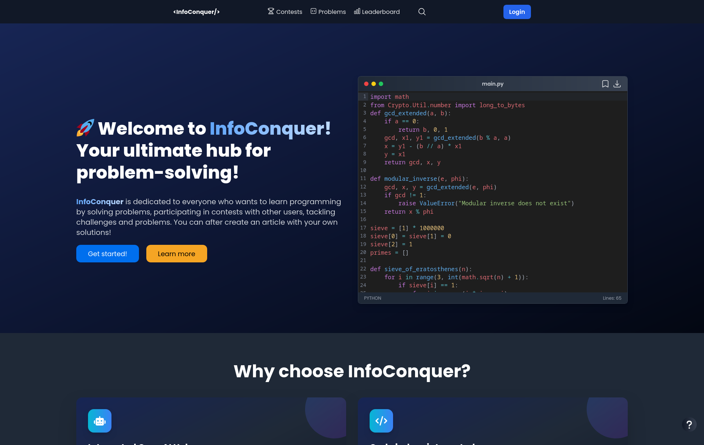

# 🚀 InfoConquer

> InfoConquer este un website destinat programatorilor, fie că sunt începători sau avansați. Utilizatorii pot rezolva probleme de algoritmică, primind feedback bazat pe testele încărcate de pe platformă. Problemele variază de la structuri de date fundamentale la teorii avansate ale grafurilor. Totodată, ei pot participa la concursuri de algoritmică împreună cu alți participanți și pot să-și mențînă o serie de rezolvare a problemelor în fiecare zi prin accesarea calendarului de pe platformă, care oferă o problema zilnică.

## 💻 Tehnologii

Prin cadrul acestui proiect, am reușit să creez un website care să faciliteze învățarea și perfecționarea abilităților de programare pentru utilizatori de toate nivelurile.

Așadar, printre funcționalitățile proiectului regăsim:

### 📘 Vizualizarea și rezolvarea de probleme
- 🧠 Utilizatorii pot rezolva probleme de algoritmică într-un limbaj de programare la alegere
- 📝 Funcționalitate supusă unui formular completat de un admin, care reprezintă toate detaliile problemei (descriere, exemple, ieșire, intrare, limita de timp, limita de memorie, teste etc.)
- 💻 Editor de cod integrat [CodeMirror](https://uiwjs.github.io/react-codemirror/)
- 📊 Statisticile problemei (grafic cu numărul de rezolvări în ultimele 7 zile, primele submisii acceptate, cele mai bune soluții în ceea ce privește timpul și memoria)

### ℹ️ Judecător de cod integrat
- 🤖 Evaluează automat soluțiile trimise de utilizatori, oferind feedback instantaneu și detaliat pe baza testelor predefinite
- 🛡️ Folosește un sandbox securizat, similar cu cel utilizat la IOI (Internațional Olympiad în Informatics)
- 🔗 Mai multe detalii: [GitHub - ioi/isolate](https://github.com/ioi/isolate)

### 🗓️ Calendar cu probleme zilnice
- 🎲 Propune o problemă aleatorie în fiecare zi
- 🏆 Încurajează utilizatorii să-și mențină seria de rezolvare, conservând o activitate mai considerabilă

### 🤖 Asistent OpenAI integrat
- 🧠 Încorporat în editorul de cod
- 💡 Ajută utilizatorii să primească feedback asupra codului lor, menționând ce poate să optimizeze, ce să schimbe și să-i ajute să rezolve problema
- 🔧 Folosește modelul GPT-4 de la [OpenAI](https://openai.com/)

### 🏆 Concursuri de algoritmică
- 🌐 Platforma poate găzdui concursuri pentru toți utilizatorii, indiferent de nivel
- 📊 Pagina concursului include clasament în timp real, detaliile concursului și un grafic privind solvabilitatea problemelor

### 👤 Profil de utilizator
- 📌 Informații generale despre utilizator (avatar, nume, status, dată creării)
- 📊 Statistici (probleme rezolvate, submisii totale, soluții acceptate)
- 📅 Vizualizare activitate
- ⚙️ Setări de profil (editare poză de profil, email, username, parolă, biografie)

### Postarea de articole și anunțuri
- 📑 Utilizatorii admini au posibilitatea de a posta articole și anunțuri, cu ajutorul editorului de text TinyMCE, la care am adăugat un add-on unde utilizatorii pot cere asistență de la Inteligența Artificială
- 📣 Funcționalitate de creare și publicare de anunțuri
- 👍 Cititorul are opțiunea de a aprecia / dezaprecia articolul

## 🖥️ Backend
În cadrul proiectului, am decis să construiesc un server bazat pe un [Node.js](https://nodejs.org/en) framework, [express](http://expressjs.com/).

- 🔗 Pentru comunicarea dintre client și server, am folosit [GraphQL](https://graphql.org/), un limbaj de interogare pentru API-uri, ce are la bază graful de date și expune un singur endpoint: /graphql, prin care sunt trimise toate mutațiile și interogările.
- 🚀 Apollo Server funcționează că un add-on pentru framework-ul express care mă ajută să asamblez un API GraphQL.
- 🗄️ Ca bază de date am ales [MongoDB](https://www.mongodb.com/), datorită structurii sale orientată pe documente, care îmi oferă flexibilitate. Serviciul destinat pentru a lucra cu datele din baza de date și a o hosta este [MongoDB Atlas](https://www.mongodb.com/atlas), un serviciu cloud integral.
- 🛡️ Pentru a crea un mediu izolat față de sistemul gazdă, cu scopul de a preveni codul malițios trimis de un utilizator să nu afecteze sistemul gazdă, am decis să folosesc [GitHub - ioi/isolate](https://github.com/ioi/isolate), un sandbox construit pentru a rula programe care nu sunt sigure. Isolate se caracterizează printr-un mediul cu access limitat, prevenind afectarea sistemului gazdă. [Documentație - isolate](www.ucw.cz/moe/isolate.1.html)

## 🎨 Frontend
Pentru construirea interfețelor de utilizator, am folosit librăria React, facilitând crearea de componente reutilizabile.

- 🖌️ Stilizarea interfeței de utilizator a fost făcută cu [Tailwind CSS](https://tailwindcss.com/), împreună cu [Next UI](https://nextui.org/), o librărie de componente moderne.
- 💻 Cu ajutorul componentei CodeMirror, care este integrată pentru a oferi un editor de cod robust și interactiv, permite utilizatorilor să scrie și să editeze soluții pentru problemele propuse într-un mediu familiar și eficient.
- 🌐 Folosind framework-ul [i18next](https://www.i18next.com/), am reușit să fac posibilă internaționalizarea conținutului, oferind suport mulți-lingv.
- 🚀 Folosind [Apollo Client](https://www.apollographql.com/docs/react/), o librărie pentru gestionarea stării aplicației și pentru comunicarea eficientă cu serverul backend cu GraphQL, am reușit să fac platforma mai scalabila, reducând traficul de rețea și timpul de răspuns al aplicației, aducând DOAR datele necesare.